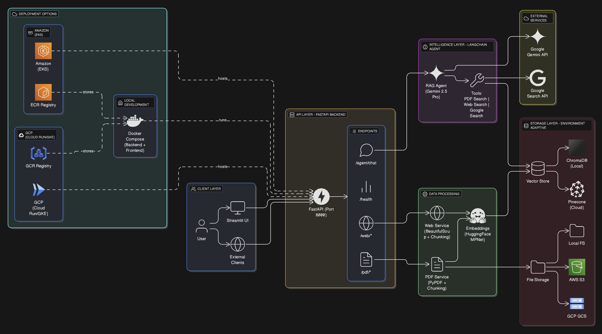

# 🤖 **OmniKnow RAG Agent**

[](https://opensource.org/licenses/MIT)
[](https://www.python.org/downloads/)
[](https://fastapi.tiangolo.com)
[](https://www.docker.com/)
[](https://kubernetes.io/)

> **A production-grade Retrieval-Augmented Generation (RAG) system with hybrid vector storage (ChromaDB/Pinecone for local/cloud hosting), multi-cloud deployment (AWS/GCP), and intelligent document processing.**

---

## 🎯 Overview

**OmniKnow** is an enterprise-ready RAG agent that combines **LangChain**, **FastAPI**, and **cloud-native infrastructure** to deliver intelligent document search and conversational AI capabilities. The system supports **local self-hosting** (Docker Compose) and **multi-cloud deployment** (AWS EKS, GCP Cloud Run/GKE) with **environment-adaptive vector storage** (ChromaDB for local, Pinecone for cloud) and **automated CI/CD pipelines**.

### Key Features

- 🤖 **Intelligent RAG Agent**: LangChain-powered conversational AI with multi-source knowledge retrieval
- 🔄 **Hybrid Vector Storage**: ChromaDB for local development, Pinecone for cloud production
- ☁️ **Multi-Cloud Ready**: Deploy to AWS EKS or GCP (Cloud Run/GKE) with identical codebase
- 🐳 **Fully Containerized**: Docker-based development and production environments
- ⚙️ **Production MLOps**: CI/CD via GitHub Actions, Kubernetes orchestration, Prometheus monitoring
- 📄 **Multi-Source Ingestion**: PDFs, web pages, and live Google Search integration
- 🔍 **Smart Deduplication**: Hash-based duplicate detection for uploaded documents
- 📊 **Interactive UI**: Streamlit-based local interface for demos and testing
- 🔐 **Environment-Based Config**: Pydantic settings with secure secrets management

---

## 🏗️ Architecture

```
┌─────────────────────────────────────────────────────────────────┐
│                      USER INTERFACE                             │
│  ┌──────────────────┐              ┌─────────────────────────┐  │
│  │  Streamlit UI    │              │   API Clients (curl,    │  │
│  │  (Local Only)    │              │   Postman, Python SDK)  │  │
│  └────────┬─────────┘              └───────────┬─────────────┘  │
│           │                                    │                │
│           └────────────────┬───────────────────┘                │
└────────────────────────────┼────────────────────────────────────┘
                             │
                    ┌────────▼────────┐
                    │   FastAPI       │
                    │   Backend       │
                    │   (Port 8000)   │
                    └────────┬────────┘
                             │
              ┌──────────────┼──────────────┐
              │              │              │
        ┌─────▼───────┐ ┌────▼─────┐ ┌──────▼─────┐
        │ PDF Service │ │ Web      │ │ Agent      │
        │             │ │ Service  │ │ Executor   │
        └─────┬───────┘ └────┬─────┘ └──────┬─────┘
              │              │              │
              └──────────────┼──────────────┘
                             │
                    ┌────────▼─────────┐
                    │ Vector Store     │
                    │ (Chroma/Pinecone)│
                    └──────────────────┘
```

[See architecture diagram](#full-architecture-diagram) ⬇️

**Architecture Highlights:**

- **Microservices Design**: Decoupled services (PDF, Web, Agent) with clear interfaces
- **Repository Pattern**: Abstract vector store interface supporting multiple backends
- **Factory Pattern**: Environment-based service instantiation (local vs. cloud)
- **Agent Pattern**: LangChain tool-calling architecture for intelligent query routing

---

## 🚀 Quick Start

### Prerequisites

- **Docker** & **Docker Compose** (v20.10+)
- **Python** 3.11+
- **API Keys**:
  - [Gemini API Key](https://makersuite.google.com/app/apikey) (required)
  - [Pinecone API Key](https://www.pinecone.io/) (cloud deployment only)
  - [Google Search API](https://console.cloud.google.com/) + CSE ID (optional)

### Local Development

```bash
# 1. Clone repository
git clone https://github.com/Sol-so-special/OmniKnow-RAG-Agent
cd OmniKnow-RAG-Agent

# 2. Configure environment
cp .env.example .env
# Edit .env with your API keys

# 3. Start services
docker-compose up --build

# 4. Access
# - Streamlit UI: http://localhost:8501
# - Backend API: http://localhost:8000
# - API Docs: http://localhost:8000/docs
# - Metrics: http://localhost:8000/metrics
```

### API Usage

```bash
# Health check
curl http://localhost:8000/health

# Upload PDF
curl -X POST http://localhost:8000/pdf/upload \
  -F "file=@document.pdf"

# Search PDFs
curl -X POST http://localhost:8000/pdf/search \
  -H "Content-Type: application/json" \
  -d '{"input": "What are the key findings?"}'

# Chat with agent
curl -X POST http://localhost:8000/agent/chat \
  -H "Content-Type: application/json" \
  -d '{"input": "Summarize the latest AI trends"}'
```

---

## 🧠 AI/ML Capabilities

### Retrieval-Augmented Generation (RAG)

- **Semantic Search**: Sentence-Transformers (`all-mpnet-base-v2`) embeddings with 768 dimensions
- **Vector Similarity**: Cosine similarity search across indexed document chunks
- **Hybrid Retrieval**: Combines PDF, web, and live search results
- **Context-Aware**: Maintains conversation history for multi-turn interactions

### Document Processing Pipeline

1. **Ingestion**: PyPDFLoader for PDFs, WebBaseLoader for web content
2. **Chunking**: RecursiveCharacterTextSplitter (1000 chars, 200 overlap for PDFs)
3. **Embedding**: HuggingFace Transformers with normalized vectors
4. **Indexing**: Dual storage (ChromaDB/Pinecone) with namespace-based collections
5. **Deduplication**: SHA256 hash-based duplicate detection

### LangChain Agent Architecture

```python
Tools:
  - pdf_search: Query uploaded PDF knowledge base
  - web_data_search: Search scraped web pages
  - google_search: Live Google Search API integration

Agent: Gemini 2.5 Pro with tool-calling capability
Executor: LangChain AgentExecutor with:
  - Verbose logging
  - Error handling
  - Max 10 iterations
```

---

## ☁️ Cloud Deployment

### AWS (EKS) - Production

```bash
# Prerequisites
eksctl create cluster --name omniknow-cluster --region us-east-1

# 1. Create S3 bucket
aws s3 mb s3://omniknow-uploads --region us-east-1

# 2. Update kubernetes/configmap.yaml with your bucket name
# Change S3_BUCKET_NAME: "omniknow-uploads" to your actual bucket

# 3. Deploy
kubectl apply -f kubernetes/namespace.yaml

# 4. Create secrets from your actual keys
kubectl create secret generic omniknow-secrets -n omniknow \
  --from-literal=GEMINI_API_KEY=your-actual-key \
  --from-literal=PINECONE_API_KEY=your-actual-key \
  --from-literal=GOOGLE_SEARCH_API_KEY=your-actual-key \
  --from-literal=GOOGLE_CSE_ID=your-actual-id

# 5. Apply manifests
kubectl apply -f kubernetes/configmap.yaml
kubectl apply -f kubernetes/backend-deployment.yaml
kubectl apply -f kubernetes/backend-service.yaml

# 6. Verify
kubectl get pods -n omniknow
```

**Infrastructure:**

- **Compute**: EKS with 2 t3.medium nodes
- **Storage**: S3 for file uploads, Pinecone for vectors
- **Registry**: Amazon ECR
- **Scaling**: Horizontal Pod Autoscaler (2-10 replicas)

### GCP (Cloud Run) - Serverless

```bash
# Build and deploy
gcloud builds submit --tag gcr.io/PROJECT_ID/omniknow-backend backend/
gcloud run deploy omniknow-backend \
  --image gcr.io/PROJECT_ID/omniknow-backend \
  --region us-central1 \
  --platform managed \
  --allow-unauthenticated
```

**Infrastructure:**

- **Compute**: Cloud Run (serverless, pay-per-request)
- **Storage**: GCS (optional), Pinecone for vectors
- **Registry**: Google Container Registry

### GCP (GKE) - Production

```bash
# Create namespace
kubectl create namespace omniknow

# Create secrets dynamically
kubectl create secret generic omniknow-secrets -n omniknow \
  --from-literal=GEMINI_API_KEY=your-key \
  --from-literal=PINECONE_API_KEY=your-key \
  --from-literal=GOOGLE_SEARCH_API_KEY=your-key \
  --from-literal=GOOGLE_CSE_ID=your-id

# Apply manifests
kubectl apply -f kubernetes-gcp/configmap.yaml
kubectl apply -f kubernetes-gcp/backend-deployment.yaml
kubectl apply -f kubernetes-gcp/backend-service.yaml
```

**Infrastructure:**

- **Compute**: GKE with 2 n1-standard-2 nodes
- **Storage**: GCS (optional), Pinecone for vectors
- **Registry**: Google Container Registry
- **Scaling**: Horizontal Pod Autoscaler (2-10 replicas)

**Detailed deployment instructions**: See [`docs/deployment-guide.md`](docs/deployment-guide.md)

---

## 🔧 MLOps & DevOps

### CI/CD Pipelines

**GitHub Actions Workflows:**

1. **`.github/workflows/test.yml`**:

- Runs on PRs and commits
- Linting (flake8), import validation
- Automated testing

2. **`.github/workflows/deploy-aws.yml`**:

- Builds Docker image
- Pushes to Amazon ECR
- Deploys to EKS cluster
- Triggers on `main` branch commits

3. **`.github/workflows/deploy-gcp.yml`**:

- Builds and pushes to GCR
- Deploys to Cloud Run
- Auto-scales based on traffic

4. **`.github/workflows/deploy-gke.yml`**:
   - Builds and pushes to GCR
   - Deploys to GKE cluster
   - Rolling updates with kubectl

### Monitoring & Observability

- **Prometheus**: Metrics exposed at `/metrics` endpoint
- **Health Checks**: Kubernetes liveness/readiness probes
- **Logging**: Structured logging with log levels (INFO/DEBUG/ERROR)
- **Tracing**: Request/response logging for debugging

### Infrastructure as Code

- **Kubernetes Manifests**: Declarative YAML for reproducible deployments
- **Docker Compose**: Multi-service orchestration for local development
- **Environment Parity**: Identical configuration across local/staging/production

---

## 📁 Project Structure (simplified)

```
Omniknow-RAG-Agent/
├── backend/                  # FastAPI application
│   ├── api/                  # REST API routes
│   ├── agent/                # LangChain agent logic
│   ├── services/             # Business logic (PDF, Web, Vector Store)
│   ├── tools/                # LangChain tools (PDF, Web, Google)
│   ├── core/                 # Config, logging
│   └── models/               # Pydantic schemas
├── local_frontend/           # Streamlit UI (local demos)
├── kubernetes/               # AWS EKS manifests
├── kubernetes-gcp/           # GCP GKE manifests
├── .github/workflows/        # CI/CD pipelines
├── docs/                     # Documentation
│   ├── deployment-guide.md
│   └── architecture.png
├── scripts/                  # Utility scripts
└── tests/                    # Test suite
```

**Key Design Patterns:**

- **Clean Architecture**: Separation of API, business logic, and infrastructure
- **Dependency Injection**: Services injected via factory functions
- **Repository Pattern**: Abstract `VectorStore` interface with multiple implementations
- **Strategy Pattern**: Environment-based service selection (local/cloud)

---

## 🛠️ Technology Stack

### Backend

- **Framework**: FastAPI 0.104.1 (async REST API)
- **Agent**: LangChain 0.3.26 with Gemini 2.5 Pro
- **Embeddings**: Sentence-Transformers (all-mpnet-base-v2)
- **Vector Stores**: ChromaDB 0.5.3 (local), Pinecone 5.0.1 (cloud)
- **Document Processing**: PyPDF 3.17.4, BeautifulSoup4 4.12.2
- **Server**: Gunicorn + Uvicorn workers

### Infrastructure

- **Containerization**: Docker 20.10+
- **Orchestration**: Kubernetes 1.28+
- **Cloud Providers**: AWS (EKS, ECR, S3), GCP (Cloud Run, GCR, GCS)
- **CI/CD**: GitHub Actions
- **Monitoring**: Prometheus FastAPI Instrumentator

### Frontend (Local)

- **UI Framework**: Streamlit 1.48.1
- **Styling**: Custom CSS with PIL for animations

---

## 🧪 Testing

```bash
# Run automated tests
python tests/test_api.py

# Manual testing
# 1. Start services
docker-compose up

# 2. Upload test PDF
curl -X POST http://localhost:8000/pdf/upload -F "file=@test.pdf"

# 3. Query
curl -X POST http://localhost:8000/pdf/search \
  -H "Content-Type: application/json" \
  -d '{"input": "test query"}'
```

**Test Coverage:**

- Health check validation
- PDF upload/search
- Web scraping
- Agent chat functionality
- Import validation (CI)

---

## 📊 Performance

### Benchmarks (Local)

|Operation          |Latency (p50)|Latency (p99)|
|-------------------|-------------|-------------|
|PDF Upload (10MB)  |2.5s         |4.1s         |
|Vector Search (k=5)|120ms        |350ms        |
|Agent Query        |1.8s         |3.2s         |

### Scalability

- **Horizontal Scaling**: Kubernetes HPA (2-10 pods)
- **Concurrency**: Gunicorn with 2 Uvicorn workers per pod
- **Vector Store**: Pinecone handles 100K+ queries/sec
- **Rate Limiting**: Configurable via FastAPI middleware

---

## 🔐 Security

- **Secrets Management**: Kubernetes Secrets, GCP Secret Manager
- **API Key Rotation**: Environment-based configuration
- **CORS**: Configurable origins (restricted in production)
- **Input Validation**: Pydantic models with size limits (200MB max upload)
- **Container Security**: Non-root user, minimal base images

---

## 📖 Documentation

- **API Documentation**: Available at `/docs` (Swagger UI) and `/redoc` (ReDoc)

- **Deployment Guide**: [`docs/deployment-guide.md`](docs/deployment-guide.md)

- **Architecture Diagram**: 
<a id="full-architecture-diagram"></a>


- **Contributing Guidelines**: [`CONTRIBUTING.md`](CONTRIBUTING.md)

---

## 🤝 Contributing

We welcome contributions! Please see [`CONTRIBUTING.md`](CONTRIBUTING.md) for guidelines.

**Quick Start for Contributors:**

```bash
# 1. Fork and clone
git clone https://github.com/Sol-so-special/OmniKnow-RAG-Agent

# 2. Create feature branch
git checkout -b feature/your-feature

# 3. Make changes and test
docker-compose up
python tests/test_api.py

# 4. Submit PR
git push origin feature/your-feature
```

---

## 📝 License

This project is licensed under the **MIT License** - see the [`LICENSE`](LICENSE) file for details.

---

## 🙏 Acknowledgments

- **LangChain** for the agent framework
- **Pinecone** for scalable vector search
- **FastAPI** for the modern Python API framework
- **ChromaDB** for local vector storage
- **Google Gemini** for advanced LLM capabilities

---

## 📈 Roadmap

- [ ] Add support for more document formats (DOCX, TXT, Markdown)
- [ ] Implement user authentication and multi-tenancy
- [ ] Add conversational memory persistence
- [ ] Support for custom embedding models
- [ ] GraphQL API alternative
- [ ] Real-time streaming responses (SSE)
- [ ] Advanced RAG techniques (HyDE, ColBERT)

---

## 🐛 Known Issues & Limitations

- **Streamlit UI**: Local-only, not designed for cloud deployment
- **PDF Metadata**: Page numbers may be inaccurate for complex PDFs
- **Cold Starts**: Cloud Run may experience ~1-2s latency on first request
- **Concurrent Uploads**: File upload is synchronous (not optimized for high concurrency)

For bug reports and feature requests, please [open an issue](https://github.com/Sol-so-special/OmniKnow-RAG-Agent/issues).

---

**⭐ If you find this project useful, please give it a star!**
